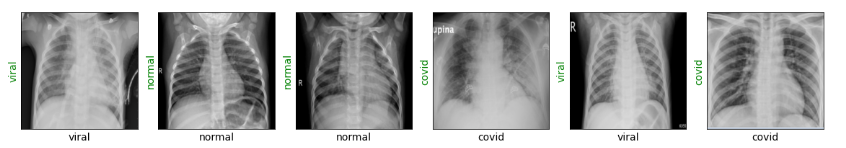

# Detecting COVID-19 with Chest XRay images
Deep learning model to classify Chest X Ray scan images between 3 classes including Viral pneumonia and COVID-19.

# Description
This Coursera project aims to classify XRay scan images between 3 classes: Normal, Viral pneumonia and COVID-19.
The project utilizes a dataset of images which can be found at Kaggle [here](https://www.kaggle.com/tawsifurrahman/covid19-radiography-database).
The dataset contains a total of 2,924 grayscale images with a significant class imbalance due to under-representation of the COVID-19 class.
- 1,341 `normal` images
- 1,345 `viral pneumonia` images
- 219 `COVID-19` images

# Approach
- I first split the dataset so that to reserve a validation set of 30 images per classes (90 images total). This will allow to measure the accuracy of the model during training.

- I then develop an approach similar to my other projects [Skin-Cancer-Classification](https://github.com/LaurentVeyssier/Skin-Cancer-Classifier-Dermatologist-AI).
  - I use ResNet18 network, with weights pre-trained on ImageNet, only adjusting the final classification layer to predict between the 3 classes.
  - I allow to fine-tune all model parameters during training

- Training conditions:
  - Adam optimizer with learning rate of 3e-5
  - Pytorch cross entropy loss function
  - Batch size of 6
  - Resized images to (224,224) and normalized as per model requierements

- The model converges in less than one epoch and achieves an accuracy of over 98% on the validation images

# How to use the notebook?
- download the image dataset from Kaggle
- Download and run the notebook

# Results

98% accuracy on average with 100% accuracy on COVID detection.

 
